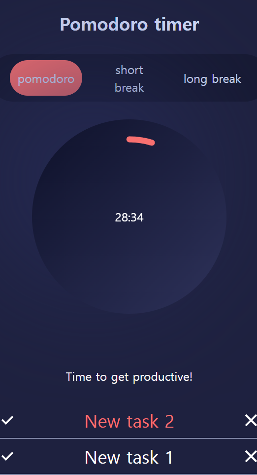

## **My Pomodoro Timer and Task manager**

[]

## [포모도로란?](https://ko.wikipedia.org/wiki/%ED%8F%AC%EB%AA%A8%EB%8F%84%EB%A1%9C_%EA%B8%B0%EB%B2%95)

# Features ✨

### Internal State management using useContext pirated by:

[](https://www.youtube.com/watch?v=ZKlXqrcBx88&t=669s)

### [Framer motion](https://github.com/framer/motion)

### Tab-controlled timer

- 포모도로 방식에 맞춘 3개의 선택 가능한 탭
- 애니메이션 svg 시계
- 포모도로 시간 추적을 위한 동적 앱 헤드
- [웹 알림](https://developer.mozilla.org/en-US/docs/Web/API/Notification)

### Tasklist

- [indexedDB](https://developer.mozilla.org/en-US/docs/Web/API/IndexedDB_API)를 통한 영구적인 작업 저장소 (계획 중)
- 작업 추가, 삭제, 드래그 앤 드롭을 통한 순서 변경

# Try It 🚀

##### Requirements

- [Node.js 18 이상](https://nodejs.org/en/download/)
- [Pnpm](https://pnpm.io/)

##### Development

```
pnpm install
pnpm dev
```

##### Production

```
pnpm install
pnpm build
pnpm start
```

##### Docker

```
docker build -t pomodoro .
docker run -dp 3000:3000 --rm --name pomodoro pomodoro
```

##### Notes

타이머 Web worker //done
타이머 worker 리팩토링 // onhold 11.19 // start와 stop 메시지가 hook에서 안먹히는 이슈 있음. // 11.26 테스팅 이후 풀

타이머 종료 이후 이전 탭의 시간으로 초기화되는 이슈 // 11.27 위 stale closure 때문에 발생함. onhold

타이머 기능 수정 // 에러 해결 11.19 cleaning 이후 testing 11.20 진행예정 // 11.26 테스트중

완료 후 타이머 svg가 안채워짐. // solved
타이머 애니메이션 circleOffset 정확하지 않음., // onhold
any 타입 수정 // solved // animation 그대로
리팩터: Clock, Tasklist //onhold
active, complete 시 순서가 마음대로 바뀜 // 순서 변하지 않도록 변경
코드 변경으로 테스트 케이스 에러 // onhold -> Consider using Playwright for easier testing
깃헙 액션 파이프라인 구축, 현재는 vercel로 수동으로 deploy 중. //onhold
윈도우: 빌드 이후 pnpm i 재시작해야하는 문제 // 관리자 모드

https://medium.com/@shubhadeepchat/best-practices-for-writing-good-user-story-86ef59d68d70
create user story for blogging

Zod 사용 타입 맞추기 //onhold
